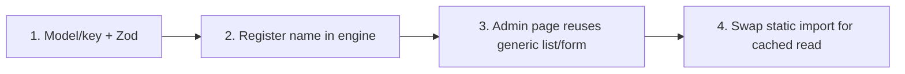

# Admin Panel + MongoDB Integration Plan (Next.js 16, Production-Ready)

This plan adds a secured admin panel and a MongoDB content backend to the existing
portfolio. It is written specifically for the stack in this repo:

- **Next.js `16.2.7`** (App Router) — note: `middleware` is now **`proxy`** and runs on
  the **Node.js runtime**.
- **React `19.2.4`**.
- **`cacheComponents: true`** is enabled in `next.config.ts`. This is the single most
  important constraint: **data fetching is dynamic by default**, and we opt specific
  reads into the cache with the `'use cache'` directive + `cacheTag`, then invalidate
  them with `revalidateTag` on admin writes.
- Path alias `@/*` → project root (from `tsconfig.json`).
- Today every section component imports static data directly from
  `app/components/data/content.ts`. The migration replaces those imports with a cached
  Data Access Layer that reads MongoDB and **falls back to `content.ts`** when the DB is
  unset or empty.

**Finalized infrastructure decisions:**

- **Deployment:** Vercel (serverless functions). Every implication below — connection
  pooling, rate-limit store, image handling — assumes ephemeral, short-lived instances.
- **Database:** MongoDB Atlas via Mongoose, using a **module-level singleton/global-cached
  connection** so warm serverless invocations reuse one pooled connection instead of
  opening a new one per request.
- **Rate limiting:** **Redis** (Upstash, serverless-friendly) — not in-memory, because
  serverless instances don't share memory.
- **Media:** **Cloudinary** — uploads go straight to Cloudinary; only the resulting URL is
  stored in Mongo.
- **Content scope:** **the entire `content.ts` is migrated** — every section and field is
  editable from the admin panel (see §7). `content.ts` remains in the repo solely as the
  cold-start fallback and the seed source.

> Tailwind v4, ESLint 9, TypeScript 5 are already configured and unaffected.

---

## 0. Guiding Principles (why the old plan needed rewriting)

1. **The security boundary is the Data Access Layer (DAL), not Proxy.** Per Next 16 docs,
   `proxy.ts` is for *optimistic* cookie checks and redirects only. Every admin route
   handler and every mutation re-verifies the session at the data source.
2. **Caching is explicit.** With `cacheComponents`, public reads must be wrapped in
   `'use cache'` and tagged, or the whole site becomes dynamic. Writes call
   `revalidateTag` so the public site reflects edits.
3. **No self-fetching.** Public server components read the DB **directly** through the
   cached DAL — they do not HTTP-fetch our own `/api/v1/*`. The `/api/v1/*` endpoints
   exist for the **admin browser client** (and optional external consumers).
4. **Fail open, read-only.** If `MONGODB_URI` is missing or a collection is empty, public
   pages render the bundled `content.ts` data so the site never breaks during rollout.

---

## 1. Access Control & Gating Strategy

| Surface | Auth | Notes |
| --- | --- | --- |
| Public pages (`/`, `/projects/[slug]`, `sitemap.ts`, `robots.ts`) | None | Read DB via cached DAL; fall back to `content.ts`. |
| Admin pages (`/admin`, `/admin/*`) | Required | Layout-level `verifySession()` redirect + optimistic `proxy.ts` pre-filter. |
| `GET /api/v1/*` | Public (read-only) | Serves the admin list/detail views; safe to expose. |
| `POST/PUT/DELETE/PATCH /api/v1/*` | Required | Each handler calls `requireAdmin()` from the DAL → `401` if invalid. |
| `POST /api/v1/auth/login` | Public | Rate-limited; the only credential-accepting endpoint. |

**Two-layer protection (defense in depth):**

- **Layer 1 — Proxy (optimistic, fast):** `proxy.ts` reads the `admin_session` cookie and
  redirects unauthenticated browser requests for `/admin/*` to `/admin/login`. It does
  **no DB work and no signature trust decisions for data** — it only short-circuits the
  obvious unauthenticated case. (Docs: "Proxy should not be used as a full session
  management or authorization solution.")
- **Layer 2 — DAL (authoritative):** `verifySession()` / `requireAdmin()` cryptographically
  verify the JWT and run inside the admin layout, every protected Server Action, and every
  mutating route handler. This is what actually protects data.

```mermaid
graph TD
    V([Public Visitor]) -->|/ or /projects/slug| Pub[Server Component → cached DAL → MongoDB → content.ts fallback]
    A([Admin]) -->|/admin/*| Proxy{proxy.ts: cookie present?}
    Proxy -->|No| Login[/admin/login]
    Proxy -->|Yes| Layout{admin layout: verifySession JWT}
    Layout -->|Invalid| Login
    Layout -->|Valid| Dash[Admin Dashboard]
    Dash -->|mutations| API[/api/v1/* handler → requireAdmin → write → revalidateTag/]
```

---

## 2. Folder Structure

```text
new-portfolio/
├── proxy.ts                       # (NEW) Next 16 replacement for middleware.ts — optimistic /admin gate
├── app/
│   ├── admin/
│   │   ├── (dashboard)/
│   │   │   ├── layout.tsx          # Calls verifySession(); renders sidebar/shell
│   │   │   ├── page.tsx            # Overview / counts
│   │   │   ├── collections/        # Collection editors (repeatable list+form):
│   │   │   │   ├── projects/       #   projectsShowcase.items
│   │   │   │   ├── testimonials/   #   testimonials.items
│   │   │   │   ├── education/       #   education.items
│   │   │   │   ├── faqs/            #   faqs.items
│   │   │   │   ├── gallery/         #   gallery.items
│   │   │   │   ├── client-logos/    #   clientLogos
│   │   │   │   ├── steps/           #   steps.items (How It Works)
│   │   │   │   ├── problems/        #   problems.items
│   │   │   │   ├── formats/         #   formats.items
│   │   │   │   ├── network/         #   network.items
│   │   │   │   └── work-process/    #   workProcess.items
│   │   │   └── singletons/          # Single-document section editors (one form each):
│   │   │       ├── site/            #   site, nav, footer (global chrome)
│   │   │       ├── hero/            #   hero
│   │   │       ├── about/           #   about
│   │   │       ├── why-it-works/    #   whyItWorks
│   │   │       ├── contact/         #   contact
│   │   │       └── final-cta/       #   finalCta
│   │   └── login/
│   │       └── page.tsx            # Split-screen login (public)
│   ├── api/
│   │   └── v1/
│   │       ├── auth/{login,logout,me}/route.ts
│   │       ├── media/sign/route.ts        # POST: signed Cloudinary upload params (admin-only)
│   │       ├── [collection]/route.ts      # GET list, POST create — generic collection handler
│   │       ├── [collection]/[id]/route.ts # GET, PUT, DELETE, PATCH (reorder/toggle)
│   │       └── singletons/[key]/route.ts  # GET, PUT — section singletons
│   └── ...                                # existing public site
├── lib/
│   ├── db/
│   │   ├── client.ts               # Global-cached Mongoose singleton (serverless-safe)
│   │   └── seed.ts                 # Idempotent seed: root admin + full content.ts import
│   ├── models/                     # One per content section (see §7)
│   │   ├── Admin.ts
│   │   ├── Project.ts  Testimonial.ts  Education.ts  Faq.ts  GalleryItem.ts ...
│   │   └── SectionSingleton.ts     # keyed single-doc store for hero/about/site/etc.
│   ├── data/                       # Cached Data Access Layer (READ) — 'use cache' + cacheTag
│   │   ├── collections.ts          # getCollection(name)
│   │   └── singletons.ts           # getSection(key)
│   ├── auth/
│   │   ├── session.ts              # signSession / verifyToken (jose)
│   │   ├── dal.ts                  # verifySession(), requireAdmin() — cache()-memoized
│   │   └── password.ts             # hash / verify (bcryptjs)
│   ├── media/
│   │   └── cloudinary.ts           # signed-upload helper (server-side signature)
│   ├── validation/
│   │   └── schemas.ts              # Zod schema per model (shared by API + forms)
│   └── http/
│       ├── responses.ts            # ok() / fail() helpers, no-store headers
│       └── rate-limit.ts           # Redis (Upstash) login limiter
└── .env.local                      # see §10 for the full variable list
```

---

## 3. Caching & Data Flow (the core of this integration)

Because `cacheComponents: true` makes reads dynamic by default, the public site uses a
**cached read layer** and admin writes **invalidate tags**.

### 3.1 Cached reads (`lib/data/*`)

```typescript
// lib/data/projects.ts
import 'server-only';
import { cacheTag } from 'next/cache';
import { connectDB } from '@/lib/db/client';
import { ProjectModel } from '@/lib/models/Project';
import { projectsShowcase } from '@/app/components/data/content'; // fallback

export async function getProjects() {
  'use cache';
  cacheTag('projects');                 // invalidated on any project write
  if (!process.env.MONGODB_URI) return projectsShowcase.items; // fail-open fallback
  await connectDB();
  const docs = await ProjectModel.find({ published: true }).sort({ order: 1 }).lean();
  return docs.length ? docs : projectsShowcase.items;
}
```

- Public Server Components import `getProjects()` instead of the static array. The static
  shell stays prerendered; data is cached and revalidated by tag, not by request.
- `getProjectBySlug(slug)` uses `cacheTag('projects', \`project:${slug}\`)`.

> **Serverless connection (`lib/db/client.ts`):** `connectDB()` caches the Mongoose
> connection promise on `globalThis` so warm Vercel invocations reuse one pooled
> connection. Without this, each cold/warm function risks exhausting Atlas connection
> limits. Keep `maxPoolSize` small (e.g. 5–10) for serverless.

### 3.2 Writes invalidate (`/api/v1/*` + Server Actions)

```typescript
import { revalidateTag } from 'next/cache';
// after a successful create/update/delete:
revalidateTag('projects');
revalidateTag(`project:${slug}`);
```

### 3.3 `/projects/[slug]` static params (must not drift)

The current page hardcodes `generateStaticParams()` **and** `unstable_instant.samples`
from `content.ts`. Once slugs live in the DB:

- `generateStaticParams()` queries the DB for slugs (cached). Set `export const dynamicParams = true` so new slugs added in the admin render on-demand without a rebuild.
- `unstable_instant.samples` **must stay a static literal** (route-segment config cannot be
  computed). Keep a small representative sample list and document that it is a
  prefetch hint only, not the source of truth.

---

## 4. Authentication (login-only, DB-backed)

1. **Credential store:** a single `Admin` document holding a **bcryptjs** hash (rounds 12).
   On first boot, `seed.ts` creates this admin from `ADMIN_USERNAME` / `ADMIN_PASSWORD`
   **only if none exists** (idempotent). Env vars are the *seed*, never the runtime check.
2. **Session token:** signed JWT via **`jose`** (not `jsonwebtoken`) — works on Node and
   any future edge usage, and is the library Next's own auth guide uses. Payload:
   `{ sub, username, role }`, short expiry (e.g. 8h), signed with `AUTH_SECRET`.
3. **Cookie `admin_session`:** `HttpOnly`, `Secure` (prod), **`SameSite: Strict`**,
   `Path: /`, `Max-Age` aligned with token expiry.
4. **CSRF:** `SameSite=Strict` + an `Origin`/`Host` same-origin check in mutating handlers.
   (Admin and API share an origin, so no cross-site forms are legitimate.)
5. **Rate limiting:** `POST /api/v1/auth/login` is limited per IP+username via **Redis
   (Upstash)** — required because Vercel serverless instances don't share memory. Use a
   fixed/sliding-window counter (e.g. `@upstash/ratelimit`) keyed on `ip:username`.
6. **Validation:** all request bodies parsed with **Zod** before touching Mongo, closing
   NoSQL-injection / mass-assignment holes. (`zod` must be added to dependencies.)
7. **DAL guards:**
   - `verifySession()` — `cache()`-memoized per render; verifies JWT, returns the admin or
     `redirect('/admin/login')`. Used by the admin layout and Server Actions.
   - `requireAdmin()` — the API-route variant; returns `401` JSON instead of redirecting.

---

## 5. API Response Contract

```typescript
export interface ApiResponse<T = unknown> {
  success: boolean;
  message: string;
  data?: T;
  error?: { code: string; details?: unknown };   // populated on failure
  meta?: { timestamp: string; path: string; count?: number };
}
```

- `lib/http/responses.ts` exports `ok(data, meta?)` and `fail(status, code, message)`.
- **Mutations & all `/admin` responses:** `Cache-Control: no-store`.
- **Public `GET /api/v1/*`:** may use `s-maxage` + tag-based revalidation if desired.
- **Security headers** (set in `next.config.ts` `headers()` or `proxy.ts`):
  `X-Content-Type-Options: nosniff`, `X-Frame-Options: DENY`,
  `Referrer-Policy: strict-origin-when-cross-origin`, and a CSP. Centralize so public and
  admin share a baseline.

---

## 6. Media / Image Handling — Cloudinary

Projects, gallery, and logo items reference images. Uploads use **Cloudinary**; Mongo
stores only the resulting `secure_url` (and `public_id` for later deletion).

- **Signed direct upload:** the admin browser requests upload params from
  `POST /api/v1/media/sign` (admin-only). That handler builds a Cloudinary **signature**
  server-side using `CLOUDINARY_API_SECRET`, so the secret never reaches the client. The
  browser then uploads the file directly to Cloudinary and posts back the returned URL.
- **No binaries in Mongo** — only `{ url, publicId }`. Deleting a record optionally calls
  Cloudinary's destroy API to clean up the asset.
- **Allowlist the host:** add `res.cloudinary.com` to `next.config.ts`
  `images.remotePatterns` (currently only `picsum.photos` and `cdn.simpleicons.org`).
- Forms also accept a plain image **URL** as a fallback, matching the existing
  `content.ts` shape and the seeded data.

---

## 7. Data Models — Full Content Migration

**Every export in `content.ts` becomes editable.** Each maps to either a *collection*
(ordered list of documents) or a *singleton* (one keyed document). Shapes mirror the
existing exports exactly so the DB path and the `content.ts` fallback are interchangeable.

| `content.ts` export | Type | Store / model | cacheTag |
| --- | --- | --- | --- |
| `projectsShowcase.items` | collection | `Project` (adds `slug`, `order`, `published`) | `projects` |
| `testimonials.items` | collection | `Testimonial` | `testimonials` |
| `education.items` | collection | `Education` | `education` |
| `faqs.items` | collection | `Faq` | `faqs` |
| `gallery.items` | collection | `GalleryItem` | `gallery` |
| `clientLogos` | collection | `ClientLogo` | `client-logos` |
| `steps.items` | collection | `Step` | `steps` |
| `problems.items` | collection | `Problem` | `problems` |
| `formats.items` | collection | `Format` | `formats` |
| `network.items` | collection | `NetworkItem` | `network` |
| `workProcess.items` | collection | `WorkProcessStep` | `work-process` |
| `site`, `nav`, `footer` | singleton | `SectionSingleton(key)` | `singleton:site` … |
| `hero` | singleton | `SectionSingleton('hero')` | `singleton:hero` |
| `about` | singleton | `SectionSingleton('about')` | `singleton:about` |
| `whyItWorks` | singleton | `SectionSingleton('whyItWorks')` | `singleton:whyItWorks` |
| `contact` | singleton | `SectionSingleton('contact')` | `singleton:contact` |
| `finalCta` | singleton | `SectionSingleton('finalCta')` | `singleton:finalCta` |
| (auth) | — | `Admin` (bcrypt hash) | — |

**Conventions**

- **Collections** share a base: `{ order: number, published: boolean, createdAt, updatedAt }`
  plus the section-specific fields. A generic API handler (`/api/v1/[collection]`) and a
  generic admin list/form drive them all, so adding a section is config, not new plumbing.
- **Singletons** are stored in one `SectionSingleton` model keyed by section name with a
  flexible `data` payload, validated per-key by its Zod schema. This avoids 6+ near-empty
  one-row models.
- Every model/section has a matching **Zod schema** in `lib/validation/schemas.ts`, reused
  by both the API handler and the admin form.
- The wrapper metadata on each section (headings, eyebrows, labels like `gallery.heading`)
  lives in the corresponding **singleton**; only the repeating `.items` arrays are
  collections.

> **Migration is still sequenced for safety** (build order in §10) — "full scope" means
> every section is in-scope, not that all are wired in a single commit. The generic
> collection/singleton machinery means each additional section is a thin addition.

---

## 8. UI Specs (unchanged in intent)

### 8.1 Split-screen login (`/admin/login`)
- Left 50%: dark espresso/gold branded panel ("Zahid Rahimoon · Admin Engine"), gradients,
  subtle motion.
- Right 50%: light-cream form card — logo, username/password, floating labels, gold focus
  states, "Sign In" with micro-interaction. Posts to `/api/v1/auth/login`.

### 8.2 CRUD screens
- List (table/grid) with sort/order indicators, `published`/`isFeatured` toggles, edit/delete.
- Side-drawer or modal form for create/edit (Zod-validated, shared schema with the API).
- Drag-and-drop or numeric `order` field for layout positioning.

---

## 9. Extensibility — repeatable module recipe



Because the collection/singleton engine is generic, most new sections need **no new API
or data plumbing** — only config + a schema:

1. `lib/models/X.ts` (or register a singleton key) + a Zod schema in `lib/validation/schemas.ts`.
2. Register the collection/singleton name so `getCollection('x')` / `getSection('x')` and
   the generic `/api/v1/[collection]` handler pick it up (`cacheTag('x')`, `revalidateTag('x')`
   are handled by the engine).
3. Add the admin page under `app/admin/(dashboard)/collections/x` (reuses the generic
   list+form) or `…/singletons/x`.
4. Replace the static import in the public section with the cached read.

---

## 10. Build Order (actionable)

1. **Deps & env:** add `mongoose`, `jose`, `bcryptjs`, `zod`, `cloudinary`,
   `@upstash/redis`, `@upstash/ratelimit`. Create `.env.local` and add all keys to Vercel
   project env + `.gitignore`. Required variables:

   ```bash
   MONGODB_URI=                 # Atlas connection string
   AUTH_SECRET=                 # JWT signing secret (jose)
   ADMIN_USERNAME=              # seed-only
   ADMIN_PASSWORD=              # seed-only
   UPSTASH_REDIS_REST_URL=
   UPSTASH_REDIS_REST_TOKEN=
   CLOUDINARY_CLOUD_NAME=
   CLOUDINARY_API_KEY=
   CLOUDINARY_API_SECRET=       # server-only, never exposed to client
   ```

2. **Infra:** `lib/db/client.ts` (global-cached singleton, small pool), `lib/http/responses.ts`,
   `lib/http/rate-limit.ts` (Upstash), `lib/auth/{password,session,dal}.ts`,
   `lib/media/cloudinary.ts`. Add `res.cloudinary.com` to `next.config.ts` remotePatterns.
3. **Auth vertical:** `proxy.ts` (optimistic `/admin` gate) → `/api/v1/auth/*` (login
   Redis-rate-limited) → `/admin/login` page → admin `(dashboard)/layout.tsx` with
   `verifySession()`.
4. **Generic engine + Projects vertical (proof of pattern):** build the generic
   `/api/v1/[collection]` handler + cached `getCollection()` + generic admin list/form,
   then wire `Project` first (slug/order/published) end-to-end, including swapping the
   public `Projects` section and `/projects/[slug]` to cached reads with `dynamicParams`.
5. **Seed:** `lib/db/seed.ts` — idempotent root admin + import the **entire** `content.ts`
   into the collection and singleton stores.
6. **Media:** `/api/v1/media/sign` + Cloudinary upload widget in the forms.
7. **Roll out remaining sections** through the generic engine (testimonials, education,
   faqs, gallery, logos, steps, problems, formats, network, work-process) and the singleton
   editors (site/nav/footer, hero, about, whyItWorks, contact, finalCta). Swap each public
   section's static import for its cached read as it lands.
8. **Hardening:** security headers/CSP, verify cold-start fallback (`MONGODB_URI` unset →
   site still renders), confirm `revalidateTag` propagation after edits.

All three infrastructure decisions are finalized (Cloudinary, Vercel serverless, MongoDB
singleton connection, Redis rate limiting, full content migration) — no open questions
remain before implementation.
